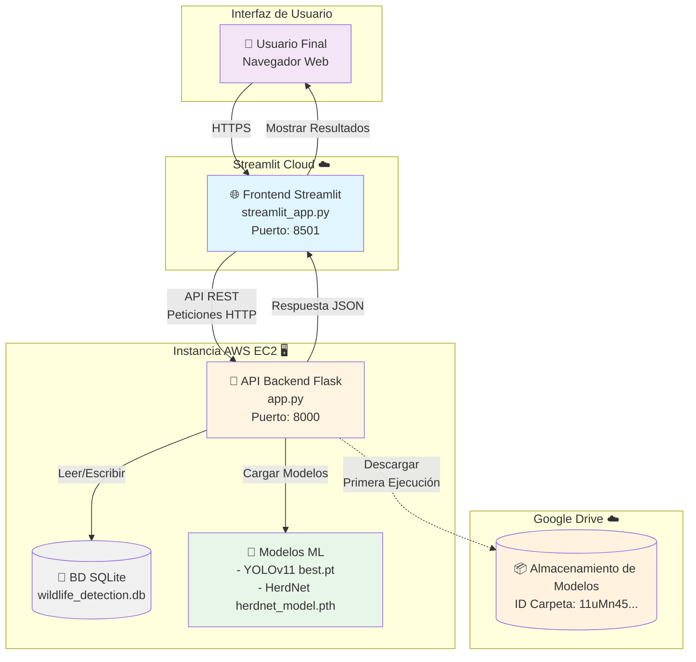
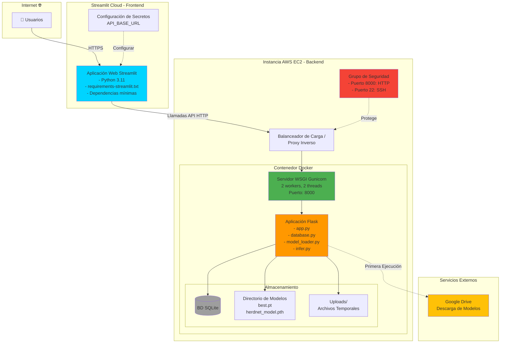
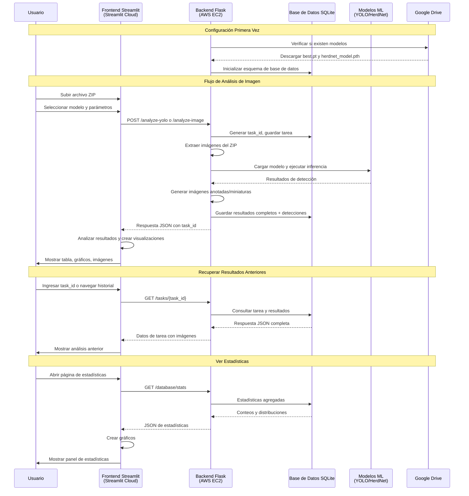
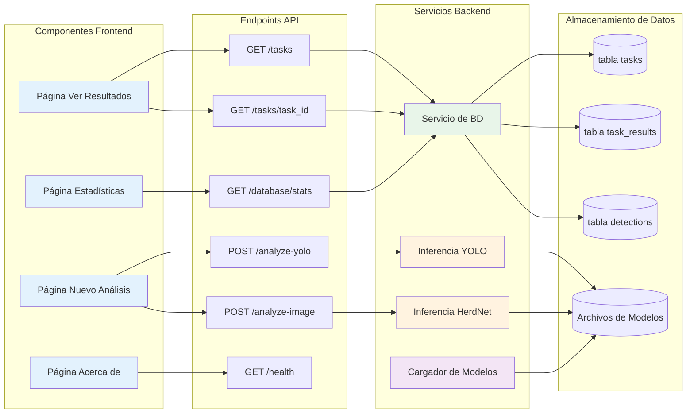
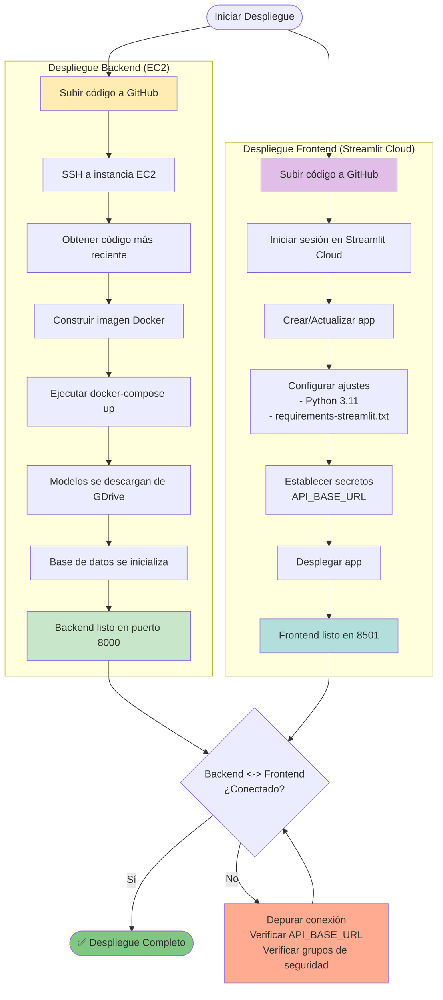
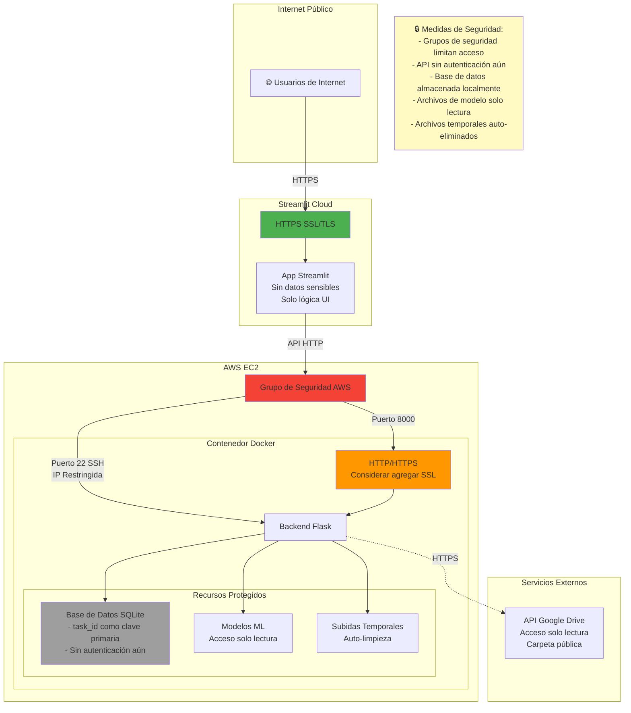
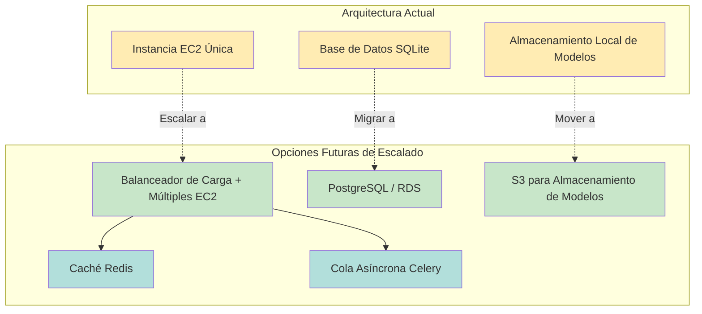

# Sistema de Detección de Fauna - Diagramas de Arquitectura

## 1. Arquitectura de Alto Nivel



---

## 2. Arquitectura de Despliegue



---

## 3. Diagrama de Flujo de Datos



---

## 4. Interacción de Componentes



---

## 5. Flujo de Despliegue



---

## 6. Arquitectura de Seguridad



---

## Stack Tecnológico

### Frontend (Streamlit Cloud)
- **Framework**: Streamlit 1.28.0
- **Lenguaje**: Python 3.11
- **Visualización**: Plotly
- **Cliente HTTP**: requests
- **Despliegue**: Streamlit Cloud (Nivel Gratuito)

### Backend (AWS EC2)
- **Framework**: Flask 3.0.0
- **Servidor WSGI**: Gunicorn
- **Lenguaje**: Python 3.11
- **Contenedor**: Docker
- **Base de Datos**: SQLite
- **Modelos ML**: 
  - YOLOv11 (ultralytics)
  - HerdNet (personalizado)
- **Aprendizaje Profundo**: PyTorch
- **Visión por Computadora**: OpenCV, albumentations
- **Despliegue**: AWS EC2 (Docker Compose)

### Servicios Externos
- **Almacenamiento de Modelos**: Google Drive
- **Control de Versiones**: GitHub
- **CI/CD**: Despliegue manual (puede automatizarse)

---

## Consideraciones de Escalabilidad



---

## Cómo Convertir Estos a PNG

### Opción 1: Usando Mermaid CLI
```bash
# Instalar mermaid-cli
npm install -g @mermaid-js/mermaid-cli

# Convertir a PNG
mmdc -i ARCHITECTURE_DIAGRAM.md -o architecture.png -b transparent
```

### Opción 2: Usando Herramientas en Línea
1. Copiar el código mermaid
2. Ir a https://mermaid.live/
3. Pegar el código
4. Click en "Descargar PNG"

### Opción 3: Usando Extensión de VS Code
1. Instalar extensión "Markdown Preview Mermaid Support"
2. Abrir este archivo en VS Code
3. Click derecho en diagrama → "Exportar como PNG"

### Opción 4: Usando Python
```python
# Instalar: pip install mermaid
from mermaid import Mermaid

diagram = """
graph TB
    A[Usuario] --> B[Streamlit]
    B --> C[API Flask]
"""

Mermaid(diagram).to_png("diagrama.png")
```
