# Sistema de Detección de Fauna - Diagramas de Arquitectura

## 1. Arquitectura de Alto Nivel

```mermaid
graph TB
    subgraph "Interfaz de Usuario"
        User[👤 Usuario Final<br/>Navegador Web]
    end
    
    subgraph "Streamlit Cloud ☁️"
        Frontend[🌐 Frontend Streamlit<br/>streamlit_app.py<br/>Puerto: 8501]
    end
    
    subgraph "Instancia AWS EC2 🖥️"
        Backend[🔧 API Backend Flask<br/>app.py<br/>Puerto: 8000]
        Database[(💾 BD SQLite<br/>wildlife_detection.db)]
        Models[🤖 Modelos ML<br/>- YOLOv11 best.pt<br/>- HerdNet herdnet_model.pth]
    end
    
    subgraph "Google Drive ☁️"
        GDrive[(📦 Almacenamiento de Modelos<br/>ID Carpeta: 11uMn45...)]
    end
    
    User -->|HTTPS| Frontend
    Frontend -->|API REST<br/>Peticiones HTTP| Backend
    Backend -->|Leer/Escribir| Database
    Backend -->|Cargar Modelos| Models
    Backend -.->|Descargar<br/>Primera Ejecución| GDrive
    Backend -->|Respuesta JSON| Frontend
    Frontend -->|Mostrar Resultados| User
    
    style Frontend fill:#e1f5ff
    style Backend fill:#fff4e1
    style Database fill:#f0f0f0
    style Models fill:#e8f5e9
    style GDrive fill:#fff3e0
    style User fill:#f3e5f5
```

---

## 2. Arquitectura de Despliegue

```mermaid
graph TB
    subgraph "Internet 🌐"
        Users[👥 Usuarios]
    end
    
    subgraph "Streamlit Cloud - Frontend"
        StreamlitApp[Aplicación Web Streamlit<br/>- Python 3.11<br/>- requirements-streamlit.txt<br/>- Dependencias mínimas]
        StreamlitConfig[Configuración de Secretos<br/>API_BASE_URL]
    end
    
    subgraph "Instancia AWS EC2 - Backend"
        LB[Balanceador de Carga /<br/>Proxy Inverso]
        
        subgraph "Contenedor Docker"
            Gunicorn[Servidor WSGI Gunicorn<br/>2 workers, 2 threads<br/>Puerto: 8000]
            FlaskApp[Aplicación Flask<br/>- app.py<br/>- database.py<br/>- model_loader.py<br/>- infer.py]
            
            subgraph "Almacenamiento"
                DB[(BD SQLite)]
                ModelsDir[Directorio de Modelos<br/>best.pt<br/>herdnet_model.pth]
                Uploads[Uploads/<br/>Archivos Temporales]
            end
        end
        
        SecurityGroup[Grupo de Seguridad<br/>- Puerto 8000: HTTP<br/>- Puerto 22: SSH]
    end
    
    subgraph "Servicios Externos"
        GDrive[Google Drive<br/>Descarga de Modelos]
    end
    
    Users -->|HTTPS| StreamlitApp
    StreamlitConfig -.->|Configurar| StreamlitApp
    StreamlitApp -->|Llamadas API HTTP| LB
    LB --> Gunicorn
    Gunicorn --> FlaskApp
    FlaskApp --> DB
    FlaskApp --> ModelsDir
    FlaskApp --> Uploads
    FlaskApp -.->|Primera Ejecución| GDrive
    SecurityGroup -.->|Protege| LB
    
    style StreamlitApp fill:#00d4ff
    style FlaskApp fill:#ff9800
    style Gunicorn fill:#4caf50
    style DB fill:#9e9e9e
    style SecurityGroup fill:#f44336
    style GDrive fill:#ffc107
```

---

## 3. Diagrama de Flujo de Datos

```mermaid
sequenceDiagram
    participant User as Usuario
    participant Streamlit as Frontend Streamlit<br/>(Streamlit Cloud)
    participant API as Backend Flask<br/>(AWS EC2)
    participant DB as Base de Datos SQLite
    participant Models as Modelos ML<br/>(YOLO/HerdNet)
    participant GDrive as Google Drive
    
    Note over User,GDrive: Configuración Primera Vez
    API->>GDrive: Verificar si existen modelos
    GDrive-->>API: Descargar best.pt y herdnet_model.pth
    API->>DB: Inicializar esquema de base de datos
    
    Note over User,GDrive: Flujo de Análisis de Imagen
    User->>Streamlit: Subir archivo ZIP
    User->>Streamlit: Seleccionar modelo y parámetros
    Streamlit->>API: POST /analyze-yolo o /analyze-image
    
    API->>DB: Generar task_id, guardar tarea
    API->>API: Extraer imágenes del ZIP
    API->>Models: Cargar modelo y ejecutar inferencia
    Models-->>API: Resultados de detección
    
    API->>API: Generar imágenes anotadas/miniaturas
    API->>DB: Guardar resultados completos + detecciones
    API-->>Streamlit: Respuesta JSON con task_id
    
    Streamlit->>Streamlit: Analizar resultados y crear visualizaciones
    Streamlit->>User: Mostrar tabla, gráficos, imágenes
    
    Note over User,GDrive: Recuperar Resultados Anteriores
    User->>Streamlit: Ingresar task_id o navegar historial
    Streamlit->>API: GET /tasks/{task_id}
    API->>DB: Consultar tarea y resultados
    DB-->>API: Respuesta JSON completa
    API-->>Streamlit: Datos de tarea con imágenes
    Streamlit->>User: Mostrar análisis anterior
    
    Note over User,GDrive: Ver Estadísticas
    User->>Streamlit: Abrir página de estadísticas
    Streamlit->>API: GET /database/stats
    API->>DB: Estadísticas agregadas
    DB-->>API: Conteos y distribuciones
    API-->>Streamlit: JSON de estadísticas
    Streamlit->>Streamlit: Crear gráficos
    Streamlit->>User: Mostrar panel de estadísticas
```

---

## 4. Interacción de Componentes

---

## 5. Flujo de Despliegue CI/CD

```mermaid
graph TD
    Start([Desarrollador hace Push])
    
    subgraph "GitHub Repository"
        Push[Git Push a main/master]
        Trigger{¿Cambios en<br/>backend?}
    end
    
    subgraph "GitHub Actions Workflow"
        GHA1[🔄 Iniciar Workflow<br/>Deploy to AWS EC2]
        GHA2[✅ Checkout código]
        GHA3[🔑 Setup SSH<br/>Configurar clave EC2]
        GHA4[📦 Rsync archivos<br/>Copiar a EC2]
        GHA5[🐳 Docker Stop<br/>Detener contenedores]
        GHA6[🧹 Docker Prune<br/>Limpiar recursos]
        GHA7[🔨 Docker Build<br/>Construir imagen]
        GHA8[🚀 Docker Up<br/>Iniciar servicios]
        GHA9[⏳ Esperar 15s<br/>Servicio arrancando]
        GHA10[🩺 Health Check<br/>Verificar puerto 8000]
        GHA11{¿Health OK?}
        GHA12[✅ Notificar Éxito]
        GHA13[❌ Notificar Fallo]
        GHA14[🧽 Cleanup<br/>Eliminar claves SSH]
    end
    
    subgraph "AWS EC2 Instance"
        EC2Deploy[📁 /home/ubuntu/maia-back-proyecto]
        EC2Docker[🐳 Docker Compose<br/>- Build imagen<br/>- Iniciar contenedor]
        EC2Models[📥 Descargar modelos<br/>Google Drive]
        EC2DB[💾 Inicializar BD SQLite]
        EC2Service[🚀 Backend Flask<br/>Puerto: 8000]
    end
    
    subgraph "Streamlit Cloud - Frontend"
        F1[🔄 Auto-detectar cambios<br/>en GitHub]
        F2[🔨 Rebuild automático]
        F3[🚀 Deploy frontend]
        F4[🌐 Frontend listo<br/>Puerto: 8501]
    end
    
    Start --> Push
    Push --> Trigger
    
    Trigger -->|Sí| GHA1
    Trigger -->|No<br/>Solo frontend/docs| F1
    
    GHA1 --> GHA2
    GHA2 --> GHA3
    GHA3 --> GHA4
    GHA4 --> EC2Deploy
    
    EC2Deploy --> GHA5
    GHA5 --> GHA6
    GHA6 --> GHA7
    GHA7 --> EC2Docker
    
    EC2Docker --> EC2Models
    EC2Models --> EC2DB
    EC2DB --> GHA8
    
    GHA8 --> GHA9
    GHA9 --> GHA10
    GHA10 --> GHA11
    
    GHA11 -->|Sí| GHA12
    GHA11 -->|No| GHA13
    
    GHA12 --> GHA14
    GHA13 --> GHA14
    
    GHA12 --> EC2Service
    
    F1 --> F2
    F2 --> F3
    F3 --> F4
    
    EC2Service --> Connected{Backend <-> Frontend<br/>¿Conectado?}
    F4 --> Connected
    
    Connected -->|Sí| Success([✅ Despliegue Completo<br/>Sistema Listo])
    Connected -->|No| Debug[🐛 Revisar logs<br/>Verificar conexión]
    Debug --> GHA10
    
    style GHA1 fill:#4CAF50
    style GHA12 fill:#81c784
    style GHA13 fill:#e57373
    style EC2Docker fill:#2196F3
    style EC2Service fill:#ff9800
    style F4 fill:#00bcd4
    style Success fill:#66bb6a
    style Debug fill:#ffab91
    style Trigger fill:#fff59d
```

---

## 8. Arquitectura de Seguridad

---

## 6. Pipeline CI/CD con GitHub Actions

---

## 7. Configuración de GitHub Secrets

```mermaid
graph LR
    subgraph "GitHub Repository Settings"
        Secrets[🔐 Secrets & Variables]
    end
    
    subgraph "Required Secrets"
        S1[EC2_SSH_KEY<br/>Clave privada SSH<br/>para acceso EC2]
        S2[EC2_HOST<br/>IP pública o hostname<br/>de instancia EC2]
        S3[EC2_USER<br/>Usuario SSH<br/>generalmente: ubuntu]
    end
    
    subgraph "GitHub Actions"
        Workflow[📄 .github/workflows/deploy.yml]
        Runner[🏃 Ubuntu Runner]
    end
    
    subgraph "AWS EC2"
        Instance[🖥️ Instancia EC2]
        SecurityGroup[🔒 Security Group<br/>Puerto 22: SSH<br/>Puerto 8000: HTTP]
    end
    
    Secrets --> S1
    Secrets --> S2
    Secrets --> S3
    
    S1 --> Workflow
    S2 --> Workflow
    S3 --> Workflow
    
    Workflow --> Runner
    Runner -->|SSH con clave| Instance
    SecurityGroup -.->|Protege| Instance
    
    style S1 fill:#f44336
    style S2 fill:#ff9800
    style S3 fill:#ffc107
    style Workflow fill:#4caf50
    style SecurityGroup fill:#e91e63
```

---

## Stack Tecnológico

### Frontend (Streamlit Cloud)
- **Framework**: Streamlit 1.28.0
- **Lenguaje**: Python 3.11
- **Visualización**: Plotly
- **Cliente HTTP**: requests
- **Despliegue**: Streamlit Cloud (Nivel Gratuito)

### Backend (AWS EC2)
- **Framework**: Flask 3.0.0
- **Servidor WSGI**: Gunicorn
- **Lenguaje**: Python 3.11
- **Contenedor**: Docker
- **Base de Datos**: SQLite
- **Modelos ML**: 
  - YOLOv11 (ultralytics)
  - HerdNet (personalizado)
- **Aprendizaje Profundo**: PyTorch
- **Visión por Computadora**: OpenCV, albumentations
- **Despliegue**: AWS EC2 (Docker Compose)

### Servicios Externos
- **Almacenamiento de Modelos**: Google Drive
- **Control de Versiones**: GitHub
- **Hosting Frontend**: Streamlit Cloud

### CI/CD Pipeline
- **Plataforma**: GitHub Actions
- **Workflow**: `.github/workflows/deploy.yml`
- **Trigger**: Push a main/master (excluyendo frontend/docs)
- **Deployment**: Automático a AWS EC2
- **Método**: SSH + rsync + Docker Compose
- **Verificación**: Health check endpoint
- **Tiempo**: ~3-5 minutos por despliegue
- **Secrets Requeridos**:
  - `EC2_SSH_KEY`: Clave privada SSH
  - `EC2_HOST`: IP/hostname de EC2
  - `EC2_USER`: Usuario SSH (ubuntu)

### Flujo de Trabajo
1. **Desarrollo**: Código en repositorio GitHub
2. **Commit**: Push a rama main/master
3. **CI/CD**: GitHub Actions detecta cambios
4. **Deploy**: Automático a EC2 vía SSH/rsync
5. **Build**: Docker Compose construye y levanta servicios
6. **Verify**: Health check confirma deployment
7. **Notify**: Resultado enviado al desarrollador

---
