# Wildlife Detection System - Architecture Diagrams

## 1. High-Level Architecture


---

## 2. Deployment Architecture

```mermaid
graph TB
    subgraph "Internet 🌐"
        Users[👥 Users]
    end
    
    subgraph "Streamlit Cloud - Frontend"
        StreamlitApp[Streamlit Web App<br/>- Python 3.11<br/>- requirements-streamlit.txt<br/>- Minimal dependencies]
        StreamlitConfig[Secrets Configuration<br/>API_BASE_URL]
    end
    
    subgraph "AWS EC2 Instance - Backend"
        LB[Load Balancer /<br/>Reverse Proxy]
        
        subgraph "Docker Container"
            Gunicorn[Gunicorn WSGI Server<br/>2 workers, 2 threads<br/>Port: 8000]
            FlaskApp[Flask Application<br/>- app.py<br/>- database.py<br/>- model_loader.py<br/>- infer.py]
            
            subgraph "Storage"
                DB[(SQLite DB)]
                ModelsDir[Models Directory<br/>best.pt<br/>herdnet_model.pth]
                Uploads[Uploads/<br/>Temporary Files]
            end
        end
        
        SecurityGroup[Security Group<br/>- Port 8000: HTTP<br/>- Port 22: SSH]
    end
    
    subgraph "External Services"
        GDrive[Google Drive<br/>Model Downloads]
    end
    
    Users -->|HTTPS| StreamlitApp
    StreamlitConfig -.->|Configure| StreamlitApp
    StreamlitApp -->|HTTP API Calls| LB
    LB --> Gunicorn
    Gunicorn --> FlaskApp
    FlaskApp --> DB
    FlaskApp --> ModelsDir
    FlaskApp --> Uploads
    FlaskApp -.->|First Run| GDrive
    SecurityGroup -.->|Protects| LB
    
    style StreamlitApp fill:#00d4ff
    style FlaskApp fill:#ff9800
    style Gunicorn fill:#4caf50
    style DB fill:#9e9e9e
    style SecurityGroup fill:#f44336
    style GDrive fill:#ffc107
```



---

## 3. Data Flow Diagram


---

## 4. Component Interaction


---

## 5. Deployment Flow


---

## 6. Security Architecture


---

## Technology Stack

### Frontend (Streamlit Cloud)
- **Framework**: Streamlit 1.28.0
- **Language**: Python 3.11
- **Visualization**: Plotly
- **HTTP Client**: requests
- **Deployment**: Streamlit Cloud (Free Tier)

### Backend (AWS EC2)
- **Framework**: Flask 3.0.0
- **WSGI Server**: Gunicorn
- **Language**: Python 3.11
- **Container**: Docker
- **Database**: SQLite
- **ML Models**: 
  - YOLOv11 (ultralytics)
  - HerdNet (custom)
- **Deep Learning**: PyTorch
- **Computer Vision**: OpenCV, albumentations
- **Deployment**: AWS EC2 (Docker Compose)

### External Services
- **Model Storage**: Google Drive
- **Version Control**: GitHub
- **CI/CD**: Manual deployment (can be automated)

---

## Scaling Considerations


---

## How to Convert These to PNG

### Option 1: Using Mermaid CLI
```bash
# Install mermaid-cli
npm install -g @mermaid-js/mermaid-cli

# Convert to PNG
mmdc -i ARCHITECTURE_DIAGRAM.md -o architecture.png -b transparent
```

### Option 2: Using Online Tools
1. Copy the mermaid code
2. Go to https://mermaid.live/
3. Paste the code
4. Click "Download PNG"

### Option 3: Using VS Code Extension
1. Install "Markdown Preview Mermaid Support" extension
2. Open this file in VS Code
3. Right-click on diagram → "Export as PNG"

### Option 4: Using Python
```python
# Install: pip install mermaid
from mermaid import Mermaid

diagram = """
graph TB
    A[User] --> B[Streamlit]
    B --> C[Flask API]
"""

Mermaid(diagram).to_png("diagram.png")
```

