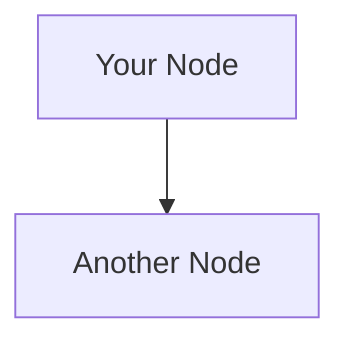

# 📊 Architecture Diagrams - Quick Guide

I've created comprehensive architecture and deployment diagrams for your Wildlife Detection System!

## 🎨 What Diagrams Were Created

### 1. **High-Level Architecture** 
Shows the complete system: User → Streamlit Cloud → AWS EC2 Backend → Database/Models

### 2. **Deployment Architecture**
Detailed view of how components are deployed (Docker, Gunicorn, Security Groups, etc.)

### 3. **Data Flow Sequence**
Step-by-step flow of image analysis from upload to results

### 4. **Component Interaction**
How frontend pages connect to API endpoints and backend services

### 5. **Deployment Flow**
The process of deploying both backend (EC2) and frontend (Streamlit Cloud)

---

## 📥 How to Generate PNG Files

### Method 1: Use the HTML File (Easiest!) ⭐

1. **Open `diagrams.html` in your browser**
   ```bash
   open diagrams.html  # macOS
   # or just double-click the file
   ```

2. **Wait for diagrams to render** (2-3 seconds)

3. **Click "Download PNG"** button under each diagram

4. **Done!** PNG files will download to your Downloads folder

### Method 2: Use Online Tool

1. **Go to** https://mermaid.live/

2. **Open `ARCHITECTURE_DIAGRAM.md`**

3. **Copy** any diagram code (between ` ```mermaid` and ` ``` `)

4. **Paste** into mermaid.live editor

5. **Click** "Download PNG" button

### Method 3: Use Python Script

```bash
# Install requests if needed
pip install requests

# Run the generator
python generate_diagrams.py

# PNG files will be saved to diagrams/ folder
```

### Method 4: Screenshot

1. Open `diagrams.html` in browser
2. Take screenshot of any diagram
3. Crop to desired size

---

## 📁 Files Created

```
back/
├── ARCHITECTURE_DIAGRAM.md    # Mermaid diagrams in markdown
├── diagrams.html              # Interactive HTML viewer ⭐ USE THIS
├── generate_diagrams.py       # Python script to generate PNGs
└── DIAGRAMS_README.md         # This file
```

---

## 🖼️ Diagrams Overview

### 1️⃣ High-Level Architecture
```
User → Streamlit (Cloud) → Flask API (EC2) → Database/Models
                              ↓
                        Google Drive (Models)
```

**Key Points:**
- Streamlit handles UI (Streamlit Cloud)
- Flask handles AI processing (AWS EC2)
- Models downloaded from Google Drive
- SQLite stores all results

---

### 2️⃣ Deployment Architecture
```
Frontend: Streamlit Cloud
  - Python 3.11
  - Minimal dependencies
  - requirements-streamlit.txt

Backend: AWS EC2 + Docker
  - Gunicorn WSGI server
  - Flask app
  - SQLite database
  - ML models (YOLO + HerdNet)
  - Security Group (ports 8000, 22)
```

**Key Points:**
- Separate deployment locations
- Docker containerization
- Security groups for protection
- Model auto-download on first run

---

### 3️⃣ Data Flow Sequence
```
1. User uploads ZIP → Streamlit
2. Streamlit calls API → Flask
3. Flask saves task → Database
4. Flask runs inference → Models
5. Flask returns results → Streamlit
6. Streamlit displays → User
```

**Key Points:**
- Unique task_id for each analysis
- Complete JSON response stored
- Base64-encoded images included
- Results retrievable anytime

---

### 4️⃣ Component Interaction
```
Frontend Pages:
  - New Analysis → /analyze-yolo, /analyze-image
  - View Results → /tasks, /tasks/<id>
  - Statistics → /database/stats

Backend Services:
  - YOLO Inference
  - HerdNet Inference
  - Database Service
  - Model Loader
```

**Key Points:**
- RESTful API design
- Clear separation of concerns
- Modular architecture
- Easy to extend

---

### 5️⃣ Deployment Flow
```
Backend Flow:
1. Push code to GitHub
2. SSH into EC2
3. Pull latest code
4. docker-compose build
5. docker-compose up
6. ✅ Backend ready

Frontend Flow:
1. Push code to GitHub
2. Streamlit Cloud auto-deploys
3. Configure Python 3.11
4. Set API_BASE_URL secret
5. ✅ Frontend ready
```

**Key Points:**
- Backend: Manual deployment via SSH
- Frontend: Automatic deployment
- Secrets configuration critical
- First run downloads models (~600MB)

---

## 🎯 Quick Start

**To get PNG diagrams RIGHT NOW:**

```bash
# Option 1: Open HTML file (easiest)
open diagrams.html

# Option 2: Use online tool
# Copy diagrams from ARCHITECTURE_DIAGRAM.md to https://mermaid.live/
```

---

## 🎨 Customizing Diagrams

### Edit the HTML file
```html
<!-- Find the diagram you want to edit -->
<div class="mermaid" id="diagram1">
  graph TB
    YourNode[Your Text]
    YourNode --> AnotherNode
</div>
```

### Edit the Python script
```python
# Find DIAGRAMS dict in generate_diagrams.py
DIAGRAMS = {
    "your_diagram": """
    graph TB
        A[Node A] --> B[Node B]
    """
}
```

### Edit the Markdown
```markdown
<!-- Edit ARCHITECTURE_DIAGRAM.md -->

```

---

## 📚 Mermaid Syntax Quick Reference

```mermaid
# Flowchart
graph TB
    A[Rectangle] --> B{Diamond}
    B -->|Yes| C[Rectangle]
    B -->|No| D[Rectangle]

# Sequence Diagram
sequenceDiagram
    Alice->>Bob: Hello
    Bob-->>Alice: Hi

# Styling
style A fill:#f9f
```

**Learn more:** https://mermaid.js.org/intro/

---

## 🔧 Troubleshooting

### Diagrams not rendering in HTML?
- Use Chrome or Firefox (best compatibility)
- Wait 2-3 seconds for rendering
- Check browser console for errors
- Try refreshing the page

### Download button not working?
- Make sure diagram is fully rendered
- Try right-click → "Save image as..." instead
- Use screenshot as fallback

### Python script fails?
- Install: `pip install requests`
- Check internet connection
- Try the HTML method instead

---

## 💡 Pro Tips

1. **High Quality PNGs**: Open HTML in browser, wait for render, then download
2. **Quick Edits**: Use https://mermaid.live/ for live preview
3. **Presentations**: Screenshots from HTML work great in PowerPoint
4. **Documentation**: Include PNG files in your README or wiki

---

## 📞 Need Help?

- **Mermaid Docs**: https://mermaid.js.org/
- **Live Editor**: https://mermaid.live/
- **Examples**: https://mermaid.js.org/syntax/examples.html

---

## ✅ Summary

**3 Ways to Get PNGs:**
1. ⭐ **Open `diagrams.html`** → Click "Download PNG" (EASIEST!)
2. 📋 Copy to https://mermaid.live/ → Download
3. 🐍 Run `python generate_diagrams.py`

**All diagrams are:**
- ✅ High resolution
- ✅ Editable (source code provided)
- ✅ Ready for presentations
- ✅ Compatible with documentation

---

🎉 **Enjoy your architecture diagrams!**

