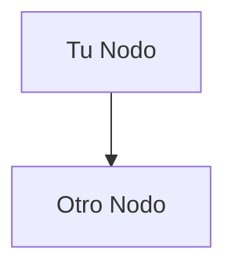

# 📊 Diagramas de Arquitectura - Guía Rápida

¡He creado diagramas completos de arquitectura y despliegue para tu Sistema de Detección de Fauna!

## 🎨 Qué Diagramas se Crearon

### 1. **Arquitectura de Alto Nivel** 
Muestra el sistema completo: Usuario → Streamlit Cloud → Backend AWS EC2 → Base de Datos/Modelos

### 2. **Arquitectura de Despliegue**
Vista detallada de cómo se despliegan los componentes (Docker, Gunicorn, Grupos de Seguridad, etc.)

### 3. **Secuencia de Flujo de Datos**
Flujo paso a paso del análisis de imagen desde la subida hasta los resultados

### 4. **Interacción de Componentes**
Cómo las páginas del frontend se conectan a los endpoints API y servicios backend

### 5. **Flujo de Despliegue**
El proceso de despliegue del backend (EC2) y frontend (Streamlit Cloud)

---

## 📥 Cómo Generar Archivos PNG

### Método 1: Usar el Archivo HTML (¡Más Fácil!) ⭐

1. **Abre `diagrams.html` en tu navegador**
   ```bash
   open diagrams.html  # macOS
   # o simplemente haz doble clic en el archivo
   ```

2. **Espera a que se rendericen los diagramas** (2-3 segundos)

3. **Haz clic en "Descargar PNG"** bajo cada diagrama

4. **¡Listo!** Los archivos PNG se descargarán a tu carpeta de Descargas

### Método 2: Usar Herramienta en Línea

1. **Ve a** https://mermaid.live/

2. **Abre `ARCHITECTURE_DIAGRAM.md`**

3. **Copia** cualquier código de diagrama (entre ` ```mermaid` y ` ``` `)

4. **Pega** en el editor de mermaid.live

5. **Haz clic** en el botón "Download PNG"

### Método 3: Usar Script de Python

```bash
# Instala requests si es necesario
pip install requests

# Ejecuta el generador
python generate_diagrams.py

# Los archivos PNG se guardarán en la carpeta diagrams/
```

### Método 4: Captura de Pantalla

1. Abre `diagrams.html` en el navegador
2. Toma una captura de pantalla de cualquier diagrama
3. Recorta al tamaño deseado

---

## 📁 Archivos Creados

```
back/
├── ARCHITECTURE_DIAGRAM.md    # Diagramas Mermaid en markdown
├── diagrams.html              # Visor HTML interactivo ⭐ USA ESTE
├── generate_diagrams.py       # Script Python para generar PNGs
└── DIAGRAMS_README.md         # Este archivo
```

---

## 🖼️ Descripción de los Diagramas

### 1️⃣ Arquitectura de Alto Nivel
```
Usuario → Streamlit (Cloud) → API Flask (EC2) → Base de Datos/Modelos
                              ↓
                        Google Drive (Modelos)
```

**Puntos Clave:**
- Streamlit maneja la UI (Streamlit Cloud)
- Flask maneja el procesamiento IA (AWS EC2)
- Modelos descargados desde Google Drive
- SQLite almacena todos los resultados

---

### 2️⃣ Arquitectura de Despliegue
```
Frontend: Streamlit Cloud
  - Python 3.11
  - Dependencias mínimas
  - requirements-streamlit.txt

Backend: AWS EC2 + Docker
  - Servidor WSGI Gunicorn
  - App Flask
  - Base de datos SQLite
  - Modelos ML (YOLO + HerdNet)
  - Grupo de Seguridad (puertos 8000, 22)
```

**Puntos Clave:**
- Ubicaciones de despliegue separadas
- Contenedorización con Docker
- Grupos de seguridad para protección
- Descarga automática de modelos en primera ejecución

---

### 3️⃣ Secuencia de Flujo de Datos
```
1. Usuario sube ZIP → Streamlit
2. Streamlit llama API → Flask
3. Flask guarda tarea → Base de Datos
4. Flask ejecuta inferencia → Modelos
5. Flask retorna resultados → Streamlit
6. Streamlit muestra → Usuario
```

**Puntos Clave:**
- task_id único para cada análisis
- Respuesta JSON completa almacenada
- Imágenes codificadas en base64 incluidas
- Resultados recuperables en cualquier momento

---

### 4️⃣ Interacción de Componentes
```
Páginas Frontend:
  - Nuevo Análisis → /analyze-yolo, /analyze-image
  - Ver Resultados → /tasks, /tasks/<id>
  - Estadísticas → /database/stats

Servicios Backend:
  - Inferencia YOLO
  - Inferencia HerdNet
  - Servicio de Base de Datos
  - Cargador de Modelos
```

**Puntos Clave:**
- Diseño API RESTful
- Separación clara de responsabilidades
- Arquitectura modular
- Fácil de extender

---

### 5️⃣ Flujo de Despliegue
```
Flujo Backend:
1. Subir código a GitHub
2. SSH a EC2
3. Obtener código más reciente
4. docker-compose build
5. docker-compose up
6. ✅ Backend listo

Flujo Frontend:
1. Subir código a GitHub
2. Streamlit Cloud auto-despliega
3. Configurar Python 3.11
4. Establecer secreto API_BASE_URL
5. ✅ Frontend listo
```

**Puntos Clave:**
- Backend: Despliegue manual vía SSH
- Frontend: Despliegue automático
- Configuración de secretos crítica
- Primera ejecución descarga modelos (~600MB)

---

## 🎯 Inicio Rápido

**Para obtener diagramas PNG AHORA MISMO:**

```bash
# Opción 1: Abrir archivo HTML (más fácil)
open diagrams.html

# Opción 2: Usar herramienta en línea
# Copia diagramas de ARCHITECTURE_DIAGRAM.md a https://mermaid.live/
```

---

## 🎨 Personalizar Diagramas

### Editar el archivo HTML
```html
<!-- Encuentra el diagrama que quieres editar -->
<div class="mermaid" id="diagram1">
  graph TB
    TuNodo[Tu Texto]
    TuNodo --> OtroNodo
</div>
```

### Editar el script Python
```python
# Encuentra el dict DIAGRAMS en generate_diagrams.py
DIAGRAMS = {
    "tu_diagrama": """
    graph TB
        A[Nodo A] --> B[Nodo B]
    """
}
```

### Editar el Markdown
```markdown
<!-- Edita ARCHITECTURE_DIAGRAM.md -->

```

---

## 📚 Referencia Rápida de Sintaxis Mermaid

```mermaid
# Diagrama de Flujo
graph TB
    A[Rectángulo] --> B{Diamante}
    B -->|Sí| C[Rectángulo]
    B -->|No| D[Rectángulo]

# Diagrama de Secuencia
sequenceDiagram
    Alice->>Bob: Hola
    Bob-->>Alice: Hola

# Estilos
style A fill:#f9f
```

**Aprende más:** https://mermaid.js.org/intro/

---

## 🔧 Solución de Problemas

### ¿Los diagramas no se renderizan en HTML?
- Usa Chrome o Firefox (mejor compatibilidad)
- Espera 2-3 segundos para renderización
- Verifica la consola del navegador para errores
- Intenta refrescar la página

### ¿El botón de descarga no funciona?
- Asegúrate de que el diagrama esté completamente renderizado
- Intenta clic derecho → "Guardar imagen como..." en su lugar
- Usa captura de pantalla como alternativa

### ¿Falla el script Python?
- Instala: `pip install requests`
- Verifica la conexión a internet
- Intenta el método HTML en su lugar

---

## 💡 Consejos Pro

1. **PNGs de Alta Calidad**: Abre HTML en navegador, espera renderización, luego descarga
2. **Ediciones Rápidas**: Usa https://mermaid.live/ para vista previa en vivo
3. **Presentaciones**: Capturas de pantalla del HTML funcionan genial en PowerPoint
4. **Documentación**: Incluye archivos PNG en tu README o wiki

---

## 📞 ¿Necesitas Ayuda?

- **Docs Mermaid**: https://mermaid.js.org/
- **Editor en Vivo**: https://mermaid.live/
- **Ejemplos**: https://mermaid.js.org/syntax/examples.html

---

## ✅ Resumen

**3 Formas de Obtener PNGs:**
1. ⭐ **Abre `diagrams.html`** → Haz clic en "Descargar PNG" (¡MÁS FÁCIL!)
2. 📋 Copia a https://mermaid.live/ → Descarga
3. 🐍 Ejecuta `python generate_diagrams.py`

**Todos los diagramas son:**
- ✅ Alta resolución
- ✅ Editables (código fuente proporcionado)
- ✅ Listos para presentaciones
- ✅ Compatibles con documentación

---

🎉 **¡Disfruta tus diagramas de arquitectura!**

