# 🎨 Architecture Diagrams for Presentation

## Overview

This document contains professional architecture diagrams for the African Wildlife Detection System, ready for presentations. All diagrams are in Mermaid format and can be exported as images.

---

## 1. 🏗️ Backend Architecture - Complete

### High-Level Backend Architecture

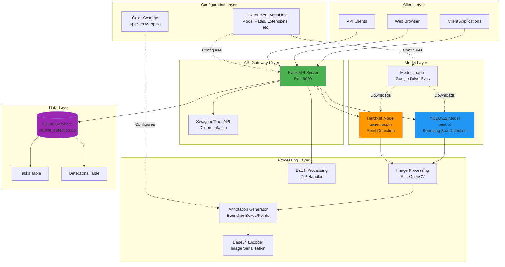

### Backend Component Details

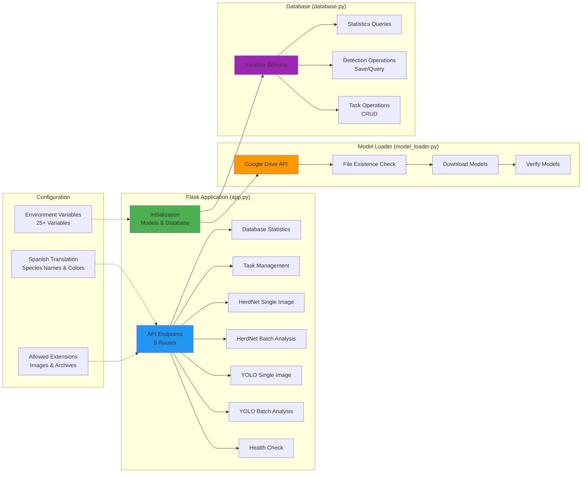

---

## 2. 💻 Frontend Architecture - Complete

### Streamlit Frontend Architecture

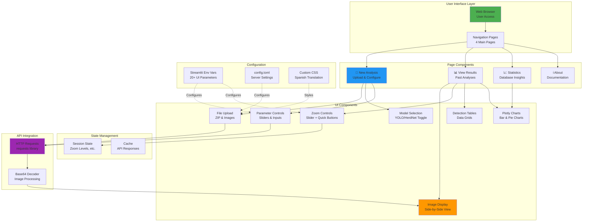

### Frontend Component Hierarchy

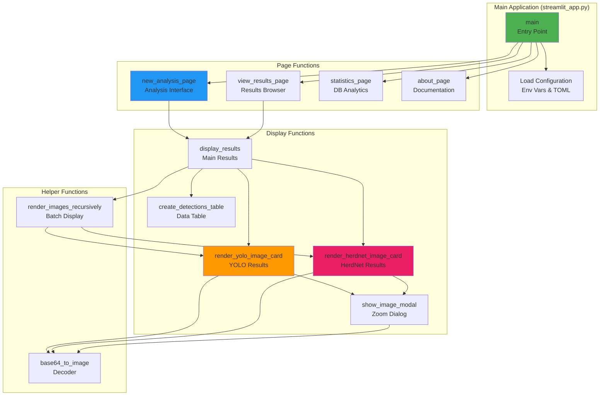

---

## 3. 🔗 Backend-Frontend Integration

### Integration Architecture

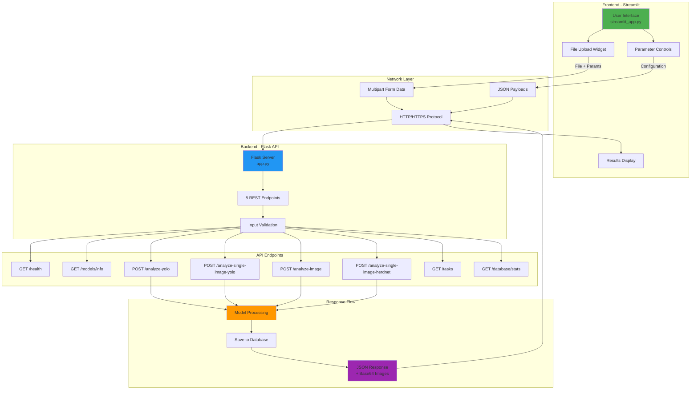

### API Communication Flow

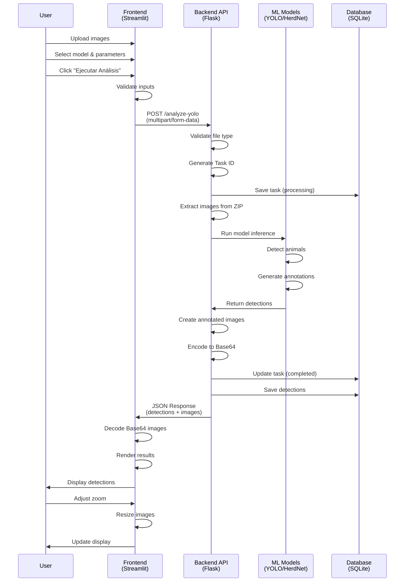

---

## 4. 🔄 Complete System Interaction

### Full System Flow

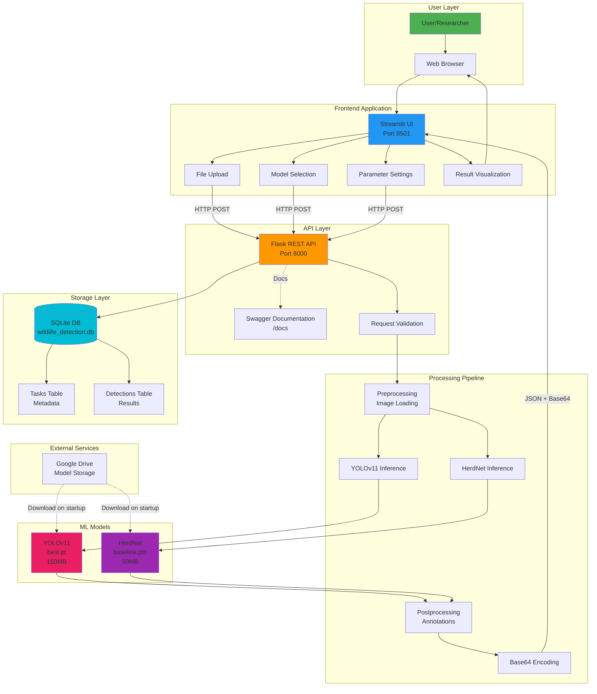

### Deployment Architecture

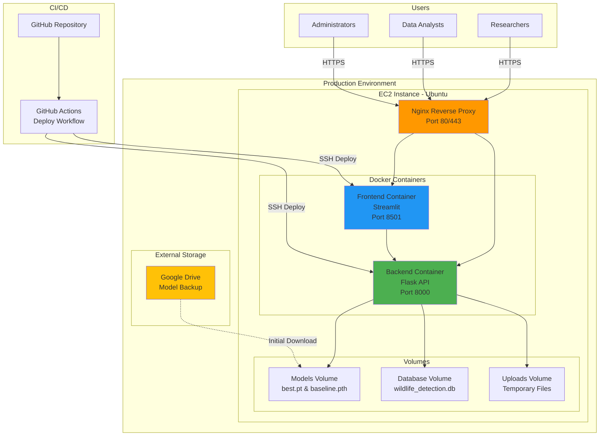

---

## 5. 📊 Data Flow Diagrams

### YOLO Analysis Data Flow

```mermaid
graph LR
    subgraph "Input"
        ZIP[ZIP File<br/>Multiple Images]
        PARAMS[Parameters<br/>Conf, IOU, Size]
    end
    
    subgraph "Upload & Extract"
        UPLOAD[Upload to Flask]
        EXTRACT[Extract Images]
        VALIDATE[Validate Files]
    end
    
    subgraph "Processing"
        LOAD[Load Images<br/>PIL]
        PREPROC[Preprocessing<br/>Resize, Normalize]
        YOLO_INF[YOLOv11 Inference]
        DETECT[Extract Detections<br/>Bboxes, Classes, Conf]
    end
    
    subgraph "Annotation"
        DRAW[Draw Bounding Boxes]
        LABEL[Add Labels<br/>Species + Confidence]
        COLOR[Apply Colors<br/>Per Species]
    end
    
    subgraph "Output Preparation"
        ORIG_B64[Encode Original<br/>Base64]
        ANNO_B64[Encode Annotated<br/>Base64]
        JSON_PREP[Prepare JSON<br/>Detections + Images]
    end
    
    subgraph "Storage"
        SAVE_TASK[Save Task Info]
        SAVE_DET[Save Detections]
    end
    
    subgraph "Response"
        JSON_RESP[JSON Response<br/>Summary + Images]
        DISPLAY[Frontend Display]
    end
    
    ZIP --> UPLOAD
    PARAMS --> UPLOAD
    
    UPLOAD --> EXTRACT
    EXTRACT --> VALIDATE
    VALIDATE --> LOAD
    
    LOAD --> PREPROC
    PREPROC --> YOLO_INF
    YOLO_INF --> DETECT
    
    DETECT --> DRAW
    DRAW --> LABEL
    LABEL --> COLOR
    
    LOAD --> ORIG_B64
    COLOR --> ANNO_B64
    DETECT --> JSON_PREP
    ORIG_B64 --> JSON_PREP
    ANNO_B64 --> JSON_PREP
    
    JSON_PREP --> SAVE_TASK
    JSON_PREP --> SAVE_DET
    
    SAVE_TASK --> JSON_RESP
    SAVE_DET --> JSON_RESP
    
    JSON_RESP --> DISPLAY
    
    style ZIP fill:#4CAF50
    style YOLO_INF fill:#2196F3
    style JSON_RESP fill:#FF9800
```

### HerdNet Analysis Data Flow

```mermaid
graph LR
    subgraph "Input"
        ZIP_H[ZIP File<br/>Aerial Images]
        PARAMS_H[Parameters<br/>Patch, Overlap, Rotation]
    end
    
    subgraph "Upload & Extract"
        UPLOAD_H[Upload to Flask]
        EXTRACT_H[Extract Images]
        VALIDATE_H[Validate Files]
    end
    
    subgraph "Dataset Preparation"
        DF[Create DataFrame]
        CSV_DS[CSVDataset]
        DL[DataLoader]
        TRANS[Apply Transforms<br/>Rotate, Normalize]
    end
    
    subgraph "Processing"
        STITCH[HerdNet Stitcher<br/>Patch-based]
        EVAL[HerdNet Evaluator]
        LMDS[Local Maxima Detection]
        POINTS[Extract Points<br/>x, y, class, score]
    end
    
    subgraph "Visualization"
        DRAW_P[Draw Points<br/>Red Circles]
        THUMB[Generate Thumbnails<br/>Per Detection]
        PLOT[Create Plot Image]
    end
    
    subgraph "Output Preparation"
        ORIG_B64_H[Encode Original<br/>Base64]
        PLOT_B64[Encode Plot<br/>Base64]
        THUMB_B64[Encode Thumbnails<br/>Base64]
        JSON_PREP_H[Prepare JSON<br/>Points + Images]
    end
    
    subgraph "Storage"
        SAVE_TASK_H[Save Task Info]
        SAVE_DET_H[Save Detections]
    end
    
    subgraph "Response"
        JSON_RESP_H[JSON Response<br/>Points + Plots]
        DISPLAY_H[Frontend Display]
    end
    
    ZIP_H --> UPLOAD_H
    PARAMS_H --> UPLOAD_H
    
    UPLOAD_H --> EXTRACT_H
    EXTRACT_H --> VALIDATE_H
    VALIDATE_H --> DF
    
    DF --> CSV_DS
    CSV_DS --> TRANS
    TRANS --> DL
    
    DL --> STITCH
    STITCH --> EVAL
    EVAL --> LMDS
    LMDS --> POINTS
    
    POINTS --> DRAW_P
    DRAW_P --> PLOT
    POINTS --> THUMB
    
    VALIDATE_H --> ORIG_B64_H
    PLOT --> PLOT_B64
    THUMB --> THUMB_B64
    
    POINTS --> JSON_PREP_H
    ORIG_B64_H --> JSON_PREP_H
    PLOT_B64 --> JSON_PREP_H
    THUMB_B64 --> JSON_PREP_H
    
    JSON_PREP_H --> SAVE_TASK_H
    JSON_PREP_H --> SAVE_DET_H
    
    SAVE_TASK_H --> JSON_RESP_H
    SAVE_DET_H --> JSON_RESP_H
    
    JSON_RESP_H --> DISPLAY_H
    
    style ZIP_H fill:#4CAF50
    style EVAL fill:#9C27B0
    style JSON_RESP_H fill:#FF9800
```

---

## 6. 🎯 Technology Stack

### Complete Technology Stack

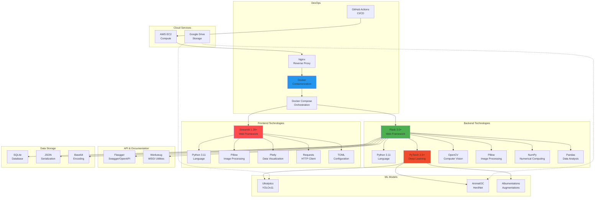

---

## 7. 📱 User Journey

### End-to-End User Journey

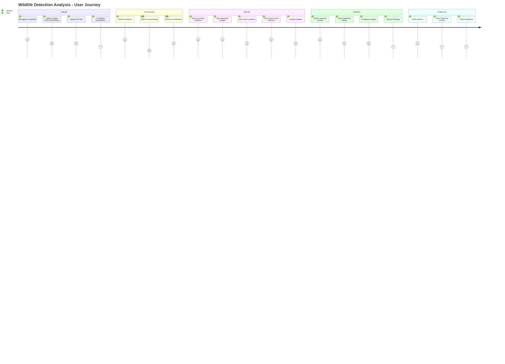

---

## 8. 🔐 Security Architecture

### Security Layers

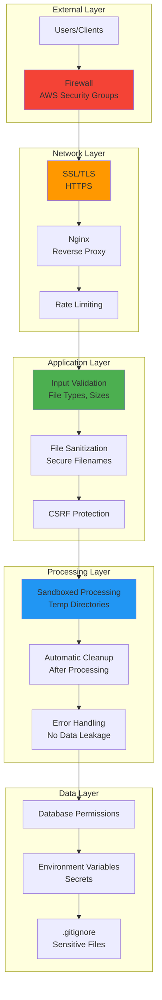

---

## 📥 Export Instructions

### How to Use These Diagrams

#### 1. **Markdown/Documentation**
- Copy the Mermaid code directly into your presentation tool
- Most modern tools (GitLab, GitHub, Obsidian) support Mermaid natively

#### 2. **Export as Images**

**Online Tools:**
- [Mermaid Live Editor](https://mermaid.live/): Paste code → Export as PNG/SVG
- [Kroki](https://kroki.io/): Generate images via URL

**CLI Tool:**
```bash
# Install mermaid-cli
npm install -g @mermaid-js/mermaid-cli

# Convert to PNG
mmdc -i diagram.mmd -o diagram.png -w 1920 -H 1080

# Convert to SVG (vector, scalable)
mmdc -i diagram.mmd -o diagram.svg
```

#### 3. **PowerPoint/Google Slides**
1. Export diagrams as PNG (high resolution: 1920x1080)
2. Insert as images into slides
3. Add annotations and labels as needed

#### 4. **LaTeX/Beamer**
```latex
\begin{figure}
  \centering
  \includegraphics[width=\textwidth]{backend_architecture.png}
  \caption{Backend Architecture}
\end{figure}
```

---

## 🎨 Presentation Slide Suggestions

### Slide 1: System Overview
- Use **Diagram 4: Complete System Interaction**
- Title: "African Wildlife Detection System Architecture"
- Bullet points: Key components, technologies, features

### Slide 2: Backend Architecture
- Use **Diagram 1: Backend Architecture - Complete**
- Title: "Backend Infrastructure"
- Bullet points: Flask API, ML models, database

### Slide 3: Frontend Architecture
- Use **Diagram 2: Frontend Architecture - Complete**
- Title: "User Interface & Experience"
- Bullet points: Streamlit UI, responsive design, real-time updates

### Slide 4: Integration
- Use **Diagram 3: Backend-Frontend Integration**
- Title: "System Integration"
- Bullet points: REST API, JSON responses, Base64 encoding

### Slide 5: Data Flow - YOLO
- Use **Diagram 5: YOLO Analysis Data Flow**
- Title: "YOLOv11 Processing Pipeline"
- Bullet points: Fast detection, bounding boxes, real-time

### Slide 6: Data Flow - HerdNet
- Use **Diagram 5: HerdNet Analysis Data Flow**
- Title: "HerdNet Processing Pipeline"
- Bullet points: Large images, point detection, thumbnails

### Slide 7: Technology Stack
- Use **Diagram 6: Technology Stack**
- Title: "Technologies & Tools"
- Bullet points: Python, PyTorch, Docker, Cloud

### Slide 8: Deployment
- Use **Deployment Architecture** from Diagram 4
- Title: "Production Deployment"
- Bullet points: AWS EC2, Docker, CI/CD, scalability

### Slide 9: Security
- Use **Diagram 8: Security Architecture**
- Title: "Security & Data Protection"
- Bullet points: SSL, validation, sandboxing, secrets

### Slide 10: User Experience
- Use **Diagram 7: User Journey**
- Title: "User Workflow"
- Bullet points: Simple upload, fast processing, rich results

---

## 📊 Diagram Color Legend

- 🟢 **Green (#4CAF50)**: User-facing components, entry points
- 🔵 **Blue (#2196F3)**: Core processing, API services
- 🟠 **Orange (#FF9800)**: Machine learning, AI models
- 🟣 **Purple (#9C27B0)**: Data storage, persistence
- 🔴 **Red (#F44336)**: Security, validation
- 🟡 **Yellow (#FFC107)**: External services, integrations

---

**Version**: 1.0.0  
**Created**: November 2025  
**Format**: Mermaid Diagrams  
**Purpose**: Presentation & Documentation

