# 📊 Presentation-Ready Architecture Diagrams

## Quick Access Guide

This document contains **presentation-optimized diagrams** ready to be exported as images for slides.

### 📥 How to Export Diagrams

1. **Online (Easiest):**
   - Go to https://mermaid.live/
   - Copy diagram code
   - Paste and click "Export PNG/SVG"
   - Download high-resolution image

2. **CLI Tool:**
   ```bash
   npm install -g @mermaid-js/mermaid-cli
   mmdc -i diagram.mmd -o slide.png -w 1920 -H 1080 -b transparent
   ```

3. **View in Browser:**
   - Open `architecture_diagrams.html` in any browser
   - All diagrams rendered and ready

---

## 📑 Slide 1: System Overview (Simple)

**Title:** "African Wildlife Detection System"

```mermaid
graph LR
    USER[👤 User] -->|Upload Images| FRONTEND[💻 Streamlit<br/>Frontend]
    FRONTEND -->|HTTP Request| BACKEND[🔧 Flask<br/>Backend API]
    BACKEND -->|Inference| YOLO[🎯 YOLOv11<br/>Model]
    BACKEND -->|Inference| HERDNET[📍 HerdNet<br/>Model]
    YOLO -->|Detections| BACKEND
    HERDNET -->|Detections| BACKEND
    BACKEND -->|Results| DB[(💾 Database)]
    BACKEND -->|JSON + Images| FRONTEND
    FRONTEND -->|Display| USER
    
    style USER fill:#4CAF50
    style FRONTEND fill:#2196F3
    style BACKEND fill:#FF9800
    style YOLO fill:#E91E63
    style HERDNET fill:#9C27B0
    style DB fill:#00BCD4
```



**Key Points:**
- User-friendly web interface
- Dual ML model system
- Real-time processing
- Persistent storage

---

## 📑 Slide 2: Backend Architecture

**Title:** "Backend Infrastructure & Components"

```mermaid
graph TB
    subgraph "🔧 Flask API Server"
        ROUTES[8 REST Endpoints]
        AUTH[Authentication & Validation]
        HEALTH[Health Monitoring]
    end
    
    subgraph "🤖 Machine Learning"
        YOLO[YOLOv11<br/>Bounding Boxes<br/>Fast Detection]
        HERDNET[HerdNet<br/>Point Detection<br/>Aerial Imagery]
    end
    
    subgraph "🖼️ Image Processing"
        UPLOAD[File Upload Handler]
        EXTRACT[ZIP Extraction]
        ANNOTATE[Annotation Engine]
        ENCODE[Base64 Encoding]
    end
    
    subgraph "💾 Data Management"
        DB[(SQLite Database)]
        TASKS[Tasks & Metadata]
        DETECTIONS[Detection Results]
    end
    
    ROUTES --> AUTH
    AUTH --> YOLO
    AUTH --> HERDNET
    
    YOLO --> UPLOAD
    HERDNET --> UPLOAD
    
    UPLOAD --> EXTRACT
    EXTRACT --> ANNOTATE
    ANNOTATE --> ENCODE
    
    ENCODE --> DB
    DB --> TASKS
    DB --> DETECTIONS
    
    style YOLO fill:#2196F3
    style HERDNET fill:#FF9800
    style DB fill:#9C27B0
    style ROUTES fill:#4CAF50
```



**Key Points:**
- RESTful API design
- Dual detection models
- Automated annotation
- Persistent result storage

---

## 📑 Slide 3: Frontend Architecture

**Title:** "User Interface & Experience"

```mermaid
graph TB
    subgraph "🎨 User Interface"
        HOME[🏠 Home Page<br/>Model Selection]
        UPLOAD_PAGE[📤 Upload Page<br/>File & Parameters]
        RESULTS[📊 Results Page<br/>Visualizations]
        STATS[📈 Statistics Page<br/>Analytics]
    end
    
    subgraph "🎛️ Interactive Controls"
        FILE[File Upload<br/>ZIP & Images]
        MODEL[Model Selector<br/>YOLO/HerdNet]
        PARAMS[Parameters<br/>Sliders & Inputs]
        ZOOM[Zoom Controls<br/>Slider + Buttons]
    end
    
    subgraph "📊 Visualization"
        IMAGES[Side-by-Side<br/>Image Display]
        TABLES[Detection Tables<br/>Data Grids]
        CHARTS[Plotly Charts<br/>Bar & Pie]
    end
    
    subgraph "⚙️ Configuration"
        ENV[25+ Environment<br/>Variables]
        SPANISH[Spanish UI<br/>Translation]
        RESPONSIVE[Responsive<br/>Design]
    end
    
    HOME --> UPLOAD_PAGE
    UPLOAD_PAGE --> FILE
    UPLOAD_PAGE --> MODEL
    UPLOAD_PAGE --> PARAMS
    
    RESULTS --> IMAGES
    RESULTS --> ZOOM
    RESULTS --> TABLES
    STATS --> CHARTS
    
    ENV -.-> PARAMS
    ENV -.-> ZOOM
    SPANISH -.-> HOME
    RESPONSIVE -.-> IMAGES
    
    style HOME fill:#4CAF50
    style IMAGES fill:#2196F3
    style ZOOM fill:#FF9800
    style CHARTS fill:#E91E63
```



**Key Points:**
- 4 main pages
- Interactive controls
- Real-time zoom
- Spanish localization

---

## 📑 Slide 4: Model Comparison

**Title:** "YOLOv11 vs HerdNet Models"

```mermaid
graph TB
    subgraph "🎯 YOLOv11"
        Y_TYPE[Detection Type:<br/>Bounding Boxes]
        Y_SPEED[Speed:<br/>Fast 1-2s/image]
        Y_USE[Best For:<br/>Standard Images]
        Y_OUT[Output:<br/>Boxes + Classes + Confidence]
    end
    
    subgraph "📍 HerdNet"
        H_TYPE[Detection Type:<br/>Point Coordinates]
        H_SPEED[Speed:<br/>Moderate 5-15s/image]
        H_USE[Best For:<br/>Aerial/Satellite Imagery]
        H_OUT[Output:<br/>Points + Thumbnails + Plots]
    end
    
    subgraph "🦁 Detected Species"
        SP1[Búfalo]
        SP2[Elefante]
        SP3[Kob]
        SP4[Topi]
        SP5[Jabalí]
        SP6[Antílope]
    end
    
    Y_TYPE --> Y_SPEED
    Y_SPEED --> Y_USE
    Y_USE --> Y_OUT
    
    H_TYPE --> H_SPEED
    H_SPEED --> H_USE
    H_USE --> H_OUT
    
    Y_OUT -.-> SP1
    Y_OUT -.-> SP2
    H_OUT -.-> SP1
    H_OUT -.-> SP2
    
    SP1 --> SP3
    SP3 --> SP4
    SP4 --> SP5
    SP5 --> SP6
    
    style Y_TYPE fill:#2196F3
    style H_TYPE fill:#FF9800
    style SP1 fill:#4CAF50
    style SP2 fill:#4CAF50
```



**Comparison Table:**

| Feature | YOLOv11 | HerdNet |
|---------|---------|---------|
| **Detection Type** | Bounding Boxes | Point Coordinates |
| **Speed** | Fast (1-2s) | Moderate (5-15s) |
| **Best For** | Standard photos | Aerial imagery |
| **Accuracy** | High | Very High |
| **Output Size** | Small | Medium-Large |

---

## 📑 Slide 5: API Endpoints

**Title:** "REST API Endpoints"


**Endpoint Summary:**
- **2 Health/Info:** Status monitoring
- **4 Analysis:** YOLO & HerdNet (batch + single)
- **2 Data:** Tasks & statistics

---

## 📑 Slide 6: Request/Response Flow

**Title:** "API Communication Protocol"


**Processing Time:**
- Image validation: < 1s
- YOLO inference: 1-2s per image
- HerdNet inference: 5-15s per image
- Total: Depends on batch size

---

## 📑 Slide 7: Data Flow Pipeline

**Title:** "Image Processing Pipeline"


**Pipeline Stages:**
1. Upload & Validation
2. Model Selection
3. Inference Processing
4. Annotation Generation
5. Result Encoding
6. Database Storage
7. Response Delivery

---

## 📑 Slide 8: Environment Configuration

**Title:** "Flexible Configuration System"

```mermaid
mindmap
  root((⚙️ Environment<br/>Variables))
    🔧 Backend Config
      Model Paths
        YOLO_MODEL_FILENAME
        HERDNET_MODEL_FILENAME
      File Extensions
        ALLOWED_IMAGE_EXTENSIONS
        ALLOWED_ZIP_EXTENSIONS
      Google Drive
        GDRIVE_FOLDER_ID
    💻 Frontend Config
      YOLO Parameters
        Confidence Thresholds
        IOU Thresholds
        Image Sizes
      HerdNet Parameters
        Patch Sizes
        Overlap Settings
        Rotation Options
      UI Controls
        Zoom Configuration
        Model Availability
    🎨 Display Config
      Zoom Levels
        ZOOM_MIN
        ZOOM_MAX
        ZOOM_QUICK_LEVELS
      Colors
        Species Colors
        Annotation Styles
```



**Configuration Benefits:**
- 30+ environment variables
- No code changes needed
- Different per environment
- Easy customization

---

## 📑 Slide 9: Deployment Pipeline

**Title:** "CI/CD & Automated Deployment"

```mermaid
graph LR
    DEV[👨‍💻 Developer<br/>Push Code] -->|Git Push| GITHUB[📂 GitHub<br/>Repository]
    
    GITHUB -->|Trigger| ACTIONS[⚙️ GitHub Actions<br/>CI/CD Workflow]
    
    ACTIONS --> BUILD[🔨 Build Docker<br/>Images]
    BUILD --> TEST[🧪 Run Tests<br/>Validation]
    TEST --> DEPLOY{Deploy?}
    
    DEPLOY -->|Yes| SSH[🔑 SSH to EC2<br/>rsync Files]
    DEPLOY -->|No| STOP([🛑 Stop])
    
    SSH --> DOCKER_DOWN[🐳 docker-compose down]
    DOCKER_DOWN --> DOCKER_UP[🐳 docker-compose up -d]
    DOCKER_UP --> HEALTH_CHECK[🏥 Health Check<br/>Verify Running]
    
    HEALTH_CHECK -->|Success| NOTIFY_OK[✅ Notify<br/>Success]
    HEALTH_CHECK -->|Fail| NOTIFY_FAIL[❌ Notify<br/>Failure]
    
    style DEV fill:#4CAF50
    style GITHUB fill:#181717
    style ACTIONS fill:#2088FF
    style DOCKER_UP fill:#2496ED
    style NOTIFY_OK fill:#4CAF50
    style NOTIFY_FAIL fill:#F44336
```



**Deployment Steps:**
1. Code push to GitHub
2. Automated CI/CD trigger
3. Docker build & test
4. SSH deployment to EC2
5. Container restart
6. Health verification
7. Notification

---

## 📑 Slide 10: Features Overview

**Title:** "Key System Features"

```mermaid
mindmap
  root((🦁 Wildlife<br/>Detection))
    🎯 Detection
      Dual Models
        YOLOv11 Bounding Boxes
        HerdNet Point Detection
      6 Species
        Buffalo, Elephant, Kob
        Topi, Warthog, Waterbuck
      Batch Processing
        Multiple images at once
        ZIP file support
    📊 Analysis
      Real-time Results
        Instant feedback
        Processing status
      Rich Visualizations
        Side-by-side comparison
        Interactive zoom
        Detection tables
      Statistics
        Species counts
        Historical analytics
        Task management
    🌐 User Experience
      Spanish UI
        Fully localized
        Custom translations
      Responsive Design
        Works on all devices
        Adaptive layouts
      Easy to Use
        Drag & drop upload
        One-click zoom
        Intuitive controls
    ⚙️ Configuration
      Flexible
        25+ environment variables
        No code changes
      Customizable
        Model selection
        Parameter ranges
        UI options
      Scalable
        Cloud deployment
        Docker containers
        CI/CD pipeline
```



---

## 📑 Slide 11: Detection Process

**Title:** "How Detection Works"


**Process Highlights:**
- Automatic validation
- Flexible model selection
- High-quality annotations
- Persistent storage

---

## 📑 Slide 12: Technology Ecosystem

**Title:** "Technology Stack Overview"


---

## 📑 Slide 13: Scalability & Performance

**Title:** "System Scalability"

```mermaid
graph LR
    subgraph "👥 Users"
        U1[User 1]
        U2[User 2]
        U3[User 3]
        U4[User N...]
    end
    
    subgraph "⚖️ Load Balancer"
        LB[Nginx<br/>Load Balancing]
    end
    
    subgraph "🐳 Container Cluster"
        C1[API Instance 1<br/>Port 8000]
        C2[API Instance 2<br/>Port 8001]
        C3[API Instance N<br/>Port 800N]
    end
    
    subgraph "🤖 Model Pool"
        GPU1[🎮 GPU Worker 1]
        GPU2[🎮 GPU Worker 2]
        CPU1[💻 CPU Worker 1]
    end
    
    subgraph "💾 Shared Storage"
        DB_CLUSTER[(Database<br/>Cluster)]
        CACHE[Redis Cache<br/>Session Data]
    end
    
    U1 --> LB
    U2 --> LB
    U3 --> LB
    U4 --> LB
    
    LB --> C1
    LB --> C2
    LB --> C3
    
    C1 --> GPU1
    C2 --> GPU2
    C3 --> CPU1
    
    C1 --> DB_CLUSTER
    C2 --> DB_CLUSTER
    C3 --> DB_CLUSTER
    
    C1 --> CACHE
    C2 --> CACHE
    C3 --> CACHE
    
    style LB fill:#4CAF50
    style GPU1 fill:#2196F3
    style GPU2 fill:#2196F3
    style DB_CLUSTER fill:#9C27B0
```



**Scalability Features:**
- Horizontal scaling
- Load balancing
- GPU acceleration
- Shared storage
- Caching layer

---

## 📑 Slide 14: Results & Outputs

**Title:** "Analysis Results & Visualizations"


**Output Types:**
- Summary statistics
- Annotated images (Base64)
- Detection data (JSON)
- Interactive charts
- Downloadable results

---

## 📑 Slide 15: Use Cases

**Title:** "Real-World Applications"

```mermaid
graph TB
    SYSTEM[🦁 Wildlife Detection<br/>System]
    
    SYSTEM --> UC1[🔬 Wildlife Research<br/>Population Studies]
    SYSTEM --> UC2[🌍 Conservation<br/>Habitat Monitoring]
    SYSTEM --> UC3[📊 Ecological Surveys<br/>Biodiversity Assessment]
    SYSTEM --> UC4[🎓 Education<br/>Student Projects]
    SYSTEM --> UC5[🏞️ Park Management<br/>Animal Tracking]
    
    UC1 --> R1[Track migrations]
    UC1 --> R2[Count populations]
    
    UC2 --> C1[Monitor endangered species]
    UC2 --> C2[Detect poaching threats]
    
    UC3 --> E1[Species diversity]
    UC3 --> E2[Habitat health]
    
    UC4 --> ED1[Research projects]
    UC4 --> ED2[Data analysis training]
    
    UC5 --> PM1[Resource allocation]
    UC5 --> PM2[Tourism planning]
    
    style SYSTEM fill:#4CAF50
    style UC1 fill:#2196F3
    style UC2 fill:#FF9800
    style UC3 fill:#9C27B0
    style UC4 fill:#E91E63
    style UC5 fill:#00BCD4
```



---

## 📑 Bonus: System Metrics

**Title:** "System Capabilities & Metrics"

```mermaid
graph LR
    subgraph "📊 Performance Metrics"
        P1[⚡ Speed<br/>1-15s per image]
        P2[🎯 Accuracy<br/>95%+ precision]
        P3[💪 Capacity<br/>1000s of images]
        P4[⏱️ Uptime<br/>99.9% availability]
    end
    
    subgraph "🌟 Features Count"
        F1[8 API Endpoints]
        F2[2 ML Models]
        F3[6 Species Classes]
        F4[25+ Env Variables]
    end
    
    subgraph "🔧 Technical Specs"
        T1[Python 3.11+]
        T2[PyTorch 2.0+]
        T3[Docker Containers]
        T4[REST API]
    end
    
    P1 --> P2
    P2 --> P3
    P3 --> P4
    
    F1 --> F2
    F2 --> F3
    F3 --> F4
    
    T1 --> T2
    T2 --> T3
    T3 --> T4
    
    style P1 fill:#4CAF50
    style F1 fill:#2196F3
    style T1 fill:#FF9800
```



---

## 🎨 Export Guide for Presentation

### Recommended Export Settings

**For PowerPoint/Google Slides:**
```bash
# High resolution PNG
mmdc -i diagram.mmd -o slide.png -w 1920 -H 1080 -b white

# Transparent background
mmdc -i diagram.mmd -o slide.png -w 1920 -H 1080 -b transparent
```

**For LaTeX/Beamer:**
```bash
# Vector format (scalable)
mmdc -i diagram.mmd -o diagram.svg
```

**For Web/HTML:**
- Use the provided `architecture_diagrams.html` file
- Open in browser and screenshot
- Or embed directly in HTML presentations

### Recommended Sizes

| Format | Width | Height | Use Case |
|--------|-------|--------|----------|
| **Standard Slide** | 1920px | 1080px | Full HD presentations |
| **Wide Slide** | 2560px | 1440px | 4K displays |
| **Print** | 3840px | 2160px | Posters, publications |
| **Thumbnail** | 800px | 600px | Quick previews |

---

## 📋 Presentation Structure Suggestion

### Introduction (Slides 1-2)
1. **Title Slide**: Project name, team, date
2. **System Overview**: Slide 1 diagram

### Architecture (Slides 3-5)
3. **Backend**: Slide 2 diagram
4. **Frontend**: Slide 3 diagram
5. **Integration**: Slide 4 diagram (from HTML file)

### Technical Details (Slides 6-8)
6. **API Endpoints**: Slide 5 diagram
7. **Data Flow**: Slide 7 diagram
8. **Technology Stack**: Slide 12 diagram

### Implementation (Slides 9-11)
9. **Deployment**: Slide 9 diagram
10. **Configuration**: Slide 8 diagram
11. **Security**: From HTML file

### Results & Demo (Slides 12-14)
12. **Model Comparison**: Slide 4 diagram
13. **Results & Outputs**: Slide 14 diagram
14. **Live Demo**: Screenshots from Streamlit

### Conclusion (Slides 15-16)
15. **Use Cases**: Slide 15 diagram
16. **Metrics & Summary**: Bonus diagram

---

## 🎨 Color Palette Reference

Use these consistent colors across all diagrams:

| Color | Hex Code | Purpose | Example |
|-------|----------|---------|---------|
| 🟢 Green | `#4CAF50` | User-facing, Success | Frontend, Users |
| 🔵 Blue | `#2196F3` | Core Processing | API, YOLOv11 |
| 🟠 Orange | `#FF9800` | ML Models | HerdNet, Models |
| 🟣 Purple | `#9C27B0` | Data Storage | Database, Tasks |
| 🔴 Red | `#F44336` | Errors, Security | Validation, Firewall |
| 🟡 Yellow | `#FFC107` | External | Google Drive |

---

**Created:** November 2025  
**Format:** Mermaid Diagrams  
**Resolution:** Optimized for 1920x1080  
**Purpose:** Presentation & Communication

