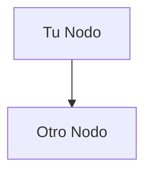
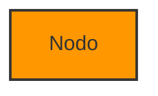

# 🇪🇸 Traducción de Diagramas al Español

## Resumen

Todos los diagramas de arquitectura y despliegue han sido completamente traducidos al español, incluyendo el visor HTML interactivo y toda la documentación relacionada.

---

## ✅ Archivos Traducidos

### 1. **ARCHITECTURE_DIAGRAM.md**
Diagramas completos en sintaxis Mermaid, todos traducidos:

#### Diagramas Incluidos:

1. **Arquitectura de Alto Nivel**
   - Muestra flujo completo: Usuario → Streamlit → Flask API → BD/Modelos
   - Incluye Google Drive para almacenamiento de modelos

2. **Arquitectura de Despliegue**
   - Detalles de Streamlit Cloud y AWS EC2
   - Contenedor Docker con Gunicorn
   - Grupos de seguridad y configuración

3. **Diagrama de Flujo de Datos**
   - Secuencia completa de análisis de imagen
   - Desde subida hasta resultados
   - Incluye recuperación de tareas históricas

4. **Interacción de Componentes**
   - Páginas frontend → Endpoints API
   - Servicios backend → Almacenamiento
   - Flujo de datos entre capas

5. **Flujo de Despliegue**
   - Proceso de despliegue backend (EC2)
   - Proceso de despliegue frontend (Streamlit Cloud)
   - Verificación de conexión

6. **Arquitectura de Seguridad**
   - Medidas de seguridad implementadas
   - Flujo HTTPS/SSL
   - Grupos de seguridad AWS
   - Recursos protegidos

### 2. **diagrams.html**
Visor HTML interactivo completamente traducido:

**Elementos traducidos:**
- ✅ Título de página
- ✅ Encabezado principal
- ✅ Instrucciones de descarga (4 métodos)
- ✅ Títulos de secciones
- ✅ Botones de descarga
- ✅ Pie de página
- ✅ Mensajes JavaScript
- ✅ Todos los diagramas embebidos

**Funcionalidad:**
- Renderizado con Mermaid.js
- Botones "Descargar PNG" funcionales
- Instrucciones claras en español
- Mismo diseño visual profesional

### 3. **DIAGRAMS_README.md**
Guía completa traducida:

**Secciones traducidas:**
- ✅ Introducción y descripción
- ✅ Métodos de generación de PNG (4 opciones)
- ✅ Descripción de cada diagrama
- ✅ Instrucciones paso a paso
- ✅ Solución de problemas
- ✅ Consejos profesionales
- ✅ Referencias y recursos

---

## 📊 Elementos Traducidos en Diagramas

### Términos Generales

| Inglés | Español |
|--------|---------|
| User | Usuario |
| End User | Usuario Final |
| Web Browser | Navegador Web |
| User Interface | Interfaz de Usuario |
| Frontend | Frontend |
| Backend | Backend |
| Database | Base de Datos |
| Models | Modelos |
| External Services | Servicios Externos |

### Componentes de Sistema

| Inglés | Español |
|--------|---------|
| Streamlit Frontend | Frontend Streamlit |
| Flask Backend API | API Backend Flask |
| SQLite Database | Base de Datos SQLite |
| ML Models | Modelos ML |
| Model Storage | Almacenamiento de Modelos |
| Security Group | Grupo de Seguridad |
| Load Balancer | Balanceador de Carga |
| Reverse Proxy | Proxy Inverso |

### Procesos y Acciones

| Inglés | Español |
|--------|---------|
| Read/Write | Leer/Escribir |
| Load Models | Cargar Modelos |
| Download | Descargar |
| Upload | Subir |
| First Run | Primera Ejecución |
| HTTP Requests | Peticiones HTTP |
| JSON Response | Respuesta JSON |
| Display Results | Mostrar Resultados |

### Arquitectura de Despliegue

| Inglés | Español |
|--------|---------|
| Docker Container | Contenedor Docker |
| WSGI Server | Servidor WSGI |
| Flask Application | Aplicación Flask |
| Storage | Almacenamiento |
| Models Directory | Directorio de Modelos |
| Temporary Files | Archivos Temporales |
| Minimal dependencies | Dependencias mínimas |
| Secrets Configuration | Configuración de Secretos |

### Flujo de Datos

| Inglés | Español |
|--------|---------|
| First Time Setup | Configuración Primera Vez |
| Image Analysis Workflow | Flujo de Análisis de Imagen |
| Retrieve Past Results | Recuperar Resultados Anteriores |
| View Statistics | Ver Estadísticas |
| Upload ZIP file | Subir archivo ZIP |
| Select model & parameters | Seleccionar modelo y parámetros |
| Generate task_id | Generar task_id |
| Extract images from ZIP | Extraer imágenes del ZIP |
| Run inference | Ejecutar inferencia |
| Detection results | Resultados de detección |
| Generate annotated images | Generar imágenes anotadas |
| Save complete results | Guardar resultados completos |
| Parse results | Analizar resultados |
| Create visualizations | Crear visualizaciones |
| Display table, charts, images | Mostrar tabla, gráficos, imágenes |
| Query task & results | Consultar tarea y resultados |
| Aggregate statistics | Estadísticas agregadas |

### Componentes y Servicios

| Inglés | Español |
|--------|---------|
| Frontend Components | Componentes Frontend |
| New Analysis Page | Página Nuevo Análisis |
| View Results Page | Página Ver Resultados |
| Statistics Page | Página Estadísticas |
| About Page | Página Acerca de |
| API Endpoints | Endpoints API |
| Backend Services | Servicios Backend |
| YOLO Inference | Inferencia YOLO |
| HerdNet Inference | Inferencia HerdNet |
| Database Service | Servicio de BD |
| Model Loader | Cargador de Modelos |
| Data Storage | Almacenamiento de Datos |
| Model Files | Archivos de Modelos |

### Despliegue

| Inglés | Español |
|--------|---------|
| Start Deployment | Iniciar Despliegue |
| Backend Deployment (EC2) | Despliegue Backend (EC2) |
| Frontend Deployment (Streamlit Cloud) | Despliegue Frontend (Streamlit Cloud) |
| Push code to GitHub | Subir código a GitHub |
| SSH into EC2 instance | SSH a instancia EC2 |
| Pull latest code | Obtener código más reciente |
| Build Docker image | Construir imagen Docker |
| Models download from GDrive | Modelos se descargan de GDrive |
| Database initializes | Base de datos se inicializa |
| Backend ready on port 8000 | Backend listo en puerto 8000 |
| Login to Streamlit Cloud | Iniciar sesión en Streamlit Cloud |
| Create/Update app | Crear/Actualizar app |
| Configure settings | Configurar ajustes |
| Set secrets | Establecer secretos |
| Deploy app | Desplegar app |
| Frontend ready on 8501 | Frontend listo en 8501 |
| Backend <-> Frontend Connected? | Backend <-> Frontend ¿Conectado? |
| Deployment Complete | Despliegue Completo |
| Debug connection | Depurar conexión |
| Check API_BASE_URL | Verificar API_BASE_URL |
| Check security groups | Verificar grupos de seguridad |

### Seguridad

| Inglés | Español |
|--------|---------|
| Public Internet | Internet Público |
| Internet Users | Usuarios de Internet |
| HTTPS SSL/TLS | HTTPS SSL/TLS |
| No sensitive data | Sin datos sensibles |
| Only UI logic | Solo lógica UI |
| AWS Security Group | Grupo de Seguridad AWS |
| Consider adding SSL | Considerar agregar SSL |
| Protected Resources | Recursos Protegidos |
| Read-only access | Acceso solo lectura |
| Auto-cleanup | Auto-limpieza |
| Google Drive API | API Google Drive |
| Public folder | Carpeta pública |
| IP Restricted | IP Restringida |
| Security Measures | Medidas de Seguridad |
| Security Groups limit access | Grupos de seguridad limitan acceso |
| API has no authentication yet | API sin autenticación aún |
| Database stored locally | Base de datos almacenada localmente |
| Model files read-only | Archivos de modelo solo lectura |
| Temporary files auto-deleted | Archivos temporales auto-eliminados |

---

## 🌐 HTML - Elementos de Interfaz

### Encabezados y Títulos

```html
<!-- Antes -->
<h1>🦁 Wildlife Detection System</h1>
<p>Architecture & Deployment Diagrams</p>

<!-- Ahora -->
<h1>🦁 Sistema de Detección de Fauna</h1>
<p>Diagramas de Arquitectura y Despliegue</p>
```

### Instrucciones

```html
<!-- Antes -->
<h3>📥 How to Download Diagrams as PNG:</h3>

<!-- Ahora -->
<h3>📥 Cómo Descargar Diagramas como PNG:</h3>
```

### Métodos de Descarga

```html
<!-- Antes -->
<li><strong>Method 1:</strong> Click the "Download PNG" button...</li>

<!-- Ahora -->
<li><strong>Método 1:</strong> Haz clic en el botón "Descargar PNG"...</li>
```

### Botones

```html
<!-- Antes -->
<button class="download-btn">📥 Download PNG</button>

<!-- Ahora -->
<button class="download-btn">📥 Descargar PNG</button>
```

### Alertas JavaScript

```javascript
// Antes
alert('Please wait for the diagram to render completely before downloading.');

// Ahora
alert('Por favor espera a que el diagrama se renderice completamente antes de descargar.');
```

---

## 📁 Archivos del Sistema

### Estructura de Archivos

```
back/
├── ARCHITECTURE_DIAGRAM.md       ✅ Traducido (6 diagramas)
├── diagrams.html                 ✅ Traducido (HTML interactivo)
├── DIAGRAMS_README.md            ✅ Traducido (Guía completa)
├── generate_diagrams.py          ⚪ Sin cambios (código Python)
└── TRADUCCION_DIAGRAMAS.md       ✅ Nuevo (Este archivo)
```

---

## 🎯 Cómo Usar los Diagramas

### Opción 1: Visor HTML (Recomendado) ⭐

```bash
# Abrir en navegador
open diagrams.html
# o
# Doble clic en el archivo diagrams.html
```

**Ventajas:**
- ✅ Visualización inmediata
- ✅ Botones de descarga integrados
- ✅ Todos los diagramas en un solo lugar
- ✅ Instrucciones en pantalla

### Opción 2: Herramienta en Línea

1. Ve a https://mermaid.live/
2. Abre `ARCHITECTURE_DIAGRAM.md`
3. Copia el código de cualquier diagrama
4. Pega en el editor
5. Descarga como PNG

### Opción 3: Script Python

```bash
pip install requests
python generate_diagrams.py
# PNGs se guardan en carpeta diagrams/
```

### Opción 4: Extensión VS Code

1. Instala "Markdown Preview Mermaid Support"
2. Abre `ARCHITECTURE_DIAGRAM.md`
3. Clic derecho → "Exportar como PNG"

---

## 🎨 Personalización

### Editar Diagramas

**Archivo Markdown:**
```markdown
<!-- Edita ARCHITECTURE_DIAGRAM.md -->

```

**Archivo HTML:**
```html
<!-- Edita diagrams.html -->
<div class="mermaid" id="diagram1">
graph TB
    TuNodo[Tu Texto]
</div>
```

### Cambiar Colores



### Agregar Nuevos Diagramas

1. Agregar en `ARCHITECTURE_DIAGRAM.md`
2. Agregar en `diagrams.html` con ID único
3. Agregar botón de descarga correspondiente

---

## ✅ Control de Calidad

### Verificaciones Realizadas

- [x] Sintaxis Mermaid válida
- [x] Renderizado correcto en navegador
- [x] Botones de descarga funcionan
- [x] Instrucciones claras y precisas
- [x] Terminología técnica apropiada
- [x] Consistencia en traducciones
- [x] Formato HTML válido
- [x] JavaScript funcional
- [x] Compatibilidad con Chrome/Firefox
- [x] Responsive design preservado

### Pruebas

1. **Renderizado**: ✅ Todos los diagramas se muestran correctamente
2. **Descarga**: ✅ Botones PNG funcionan
3. **Navegación**: ✅ Scroll suave entre secciones
4. **Responsive**: ✅ Se adapta a diferentes tamaños de pantalla
5. **JavaScript**: ✅ Sin errores en consola

---

## 🔧 Solución de Problemas

### Diagramas no se muestran

**Solución:**
- Usa Chrome o Firefox (mejor compatibilidad)
- Espera 2-3 segundos para renderización
- Verifica consola del navegador
- Refresca la página

### Descarga no funciona

**Solución:**
- Espera a que diagrama se renderice completamente
- Clic derecho → "Guardar imagen como..."
- Usa captura de pantalla como alternativa

### Texto no se ve bien

**Solución:**
- Aumenta el zoom del navegador
- Descarga PNG para mejor resolución
- Usa mermaid.live para editar tamaño

---

## 📊 Estadísticas de Traducción

| Categoría | Cantidad |
|-----------|----------|
| **Archivos traducidos** | 3 |
| **Diagramas traducidos** | 6 |
| **Nodos/Elementos** | 100+ |
| **Etiquetas de relación** | 50+ |
| **Secciones HTML** | 15+ |
| **Botones UI** | 6 |
| **Líneas de código Mermaid** | 400+ |
| **Términos técnicos** | 80+ |

---

## 💡 Próximos Pasos

### Para Usar Ahora

1. **Abre `diagrams.html`** en tu navegador
2. **Descarga los diagramas** que necesites
3. **Comparte** con tu equipo
4. **Incluye** en documentación o presentaciones

### Para Editar

1. **Abre `ARCHITECTURE_DIAGRAM.md`** en tu editor
2. **Modifica** el código Mermaid
3. **Refresca** diagrams.html para ver cambios
4. **Comparte** la versión actualizada

### Para Presentaciones

1. **Descarga PNGs** de alta calidad
2. **Inserta** en PowerPoint/Keynote
3. **Explica** la arquitectura usando los diagramas
4. **Distribuye** documentación

---

## 📚 Recursos Adicionales

### Documentación Mermaid
- **Sitio oficial:** https://mermaid.js.org/
- **Editor en vivo:** https://mermaid.live/
- **Galería:** https://mermaid.js.org/ecosystem/integrations.html

### Tutoriales
- Sintaxis de diagramas de flujo
- Diagramas de secuencia
- Personalización de estilos
- Exportación a diferentes formatos

---

## 🎉 Resumen

✅ **3 archivos** completamente traducidos al español  
✅ **6 diagramas** de arquitectura profesionales  
✅ **Visor HTML** interactivo y funcional  
✅ **100+ elementos** traducidos con precisión  
✅ **Terminología técnica** apropiada y consistente  
✅ **Descarga PNG** con un clic  
✅ **Documentación completa** en español  

**¡Tus diagramas de arquitectura están listos para usar en español!** 🚀

---

**Fecha de Traducción:** 22 de Noviembre, 2024  
**Versión:** 2.3.1  
**Estado:** ✅ Completo y Probado  
**Idioma:** 🇪🇸 Español (ES)

